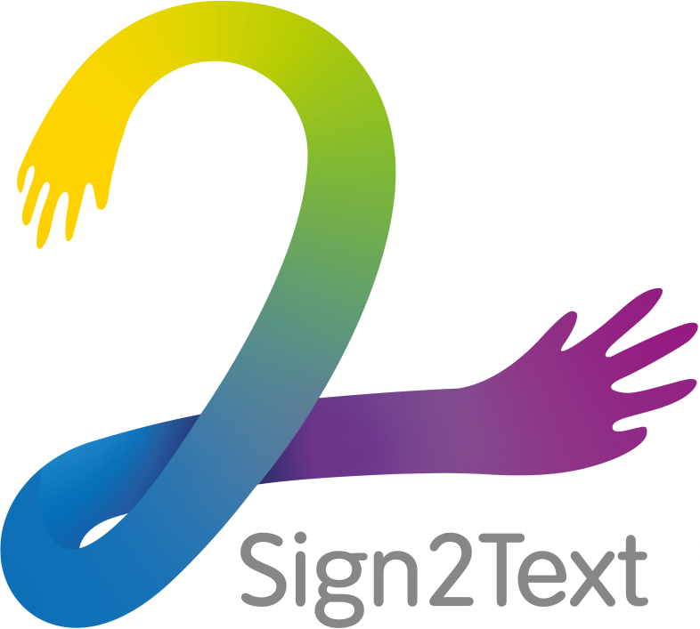

# Sign2Text - API

<table align="center"><tr><td align="center" width="9999">

<br />


<br />
<br />

Transcripción de lenguaje de signos (a nivel de palabra) mediante Deep Learning
</td></tr></table>

Hecho con fastapi como alternativa a un backend hecho con JavaScript usando onnx.js
Esto se debe a que onnx.js no es tan fiable y su ecosistema no estan rico como el de Python.

El cliente enviará un video y el servidor lo procesará y devolverá el signo clasificado de vuelta.

Alojado en Google Cloud (contenedor Docker) con integración continua y disponible en [api.sign2text.com](https://api.sign2text.com/docs)

---

## Ejecuta el servidor en local

---

> Para desarrollo

`uvicorn main:app --reload --port 8000` or `python dev.py`

> Para producción

`uvicorn main:app --port 8000`

## Ejecuta en local con Docker

---

1. Construye la imagen con `docker build -t sign2text .`
2. Ejecútalo: `docker run -p 8000:8000 sign2text`
3. Accede desde el navegador en `http://localhost:8000`

## ¿Solo necesitas la imagen del contendor?

Si quieres usar o descargar una imagen ya construida, puedes desde esta url: <https://hub.docker.com/r/gazquez/sign2text>

Tambiñen puedes descargarla usando el CLI con `docker pull gazquez/sign2text`

## Instrucciones para subir el contenedor a Azure

---

1. Inicie sesión: `docker login sign2textapi.azurecr.io` (Ver claves en Sign2TextAPI > Azure Container Registry > Claves de Acceso)
2. Añadir la etiqueta al registro: `docker tag sign2text:latest sign2textapi.azurecr.io/latest`
3. Empuje la imagen al registro: `docker push sign2textapi.azurecr.io/latest`.

### Ahora podemos tirar de la imagen si es necesario con

`docker pull sign2textapi.azurecr.io/sign2text`

## Subir el contenedor a AWS

---

1. Instalamos el CLI de AWS: `pip install awscli`
2. Configuramos el CLI: `aws configure`
3. Nos logueamos en el ECR (elastic container registry): `aws ecr get-login --region eu-west-3`
4. Ejecutamos login con Docker según la salida del comando anterior: `docker login -u AWS -p <PASSWORD> https://<ACCOUNT_ID>.dkr.ecr.<REGION>.amazonaws.com`
5. Creamos un repositorio: `aws ecr create-repository --repository-name sign2text`
6. Añadimos la etiquta al repositorio: `docker tag sign2text:latest <ACCOUNT_ID>.dkr.ecr.<REGION>.amazonaws.com/sign2text`
7. Verificamos que el tag existe: `docker images`
8. Hacemos push de la imagen al registro: `docker push <ACCOUNT_ID>.dkr.ecr.<REGION>.amazonaws.com/sign2text`
9. (Opcional) Si queremos eliminar la imagen del registro: `aws ecr batch-delete-image --repository-name sign2text --image-ids imageTag=latest`
10. (Opcional) Si queremos eliminar el repositorio: `aws ecr delete-repository --repository-name sign2text`

## Crear una app con EC2

---

1. Crear un servicio EC2 en la plataforma.
2. Conéctate a él con ssh usando el par de claves dadas con: `ssh -i "credenciales.pem" ec2-usuario@<INSTANCIA>.<REGIÓN>.compute.amazonaws.com`.
3. Cuando esté conectado, ejecute los siguientes comandos:
   1. Actualice la lista de paquetes: `sudo yum update -y`
   2. Instalar Docker: `sudo amazon-linux-extras install docker`.
   3. Inicie el docker con `sudo service docker start`.
   4. Añade el usuario ec2 al grupo docker para poder ejecutar los #comandos Docker sin usar sudo. `sudo usermod -a -G docker ec2-user`
4. Reinicaimos la instancia de EC2 desde la plataforma y nos conectamos de nuevo.
5. Al igual que en el punto anterior, subimos la imagen al ECR (Elastic Container Registry) (tag + push)
6. Una vez tenemos el registro y el EC2, nos conectamos a este último de nuevo para ejecutar la imagen.
7. Una vez conectados iniciamos aws: `aws configure`
8. Inicia el daemon de docker (ver 3.3) y añade tus credenciales (Punto anterior 3 y 4).
9. Copia la URI de la imagen de docker subida al ECR y ejecuta en la instancia: `docker pull <URI>`
10. Una vez hehco esto, ejecutamos el docker como lo haríamos de forma local: `docker run -dp 80:8000 <NAME_OF_IMAGE>`
    1. Podemos ver las imagenes con `docker images`
    2. Importante usar `80:8000` para mapear los puertos de la instancia a los puertos de la imagen.
    3. Comprobar que la imagen está corriendo con `docker ps`
11. Añadimos regla de entrada para aceptar tráfico.
    1. En la instancia > Seguridad > Grupos de Seguridad > Editar reglas de entrada
    2. Agregamos una regla con tipo "Todo el tráfico" y 0.0.0.0/0 o arreglamos regla de Https y Http Para 0.0.0.0 y ::0.
    3. La aplicación ya es accesible públicamente.

### Crear una app con Elastic Beanstalk

1. Crea una aplicación de EB desde el dashboard de AWS.
2. Elige la opción de Docker + subir código.
3. Sube un archivo Docker.aws.json
   1. Por ejemplo:

   ```json
   {
      "AWSEBDockerrunVersion": "1",
      "Image": {
         "Name": "<IMAGE_URI>",
         "Update": "true"
      },
      "Ports": [
         {
            "ContainerPort": "8000"
         }
      ]
   }
   ```

4. La imagen puede ser de ECR, Dockerhub o cualqueir otro lado.
5. Espera que la aplicación se despligue y accede al link proporcionado.

## Añadiendo el dominio con Elastic Search

---

1. Vamos a "asignar dirección ip estática"
2. Seguimos las instrucciones de Amazon hasta que nos otorgue una IP que no cambia cada vez que levantamos la instancia.
3. Con esta IP elástica podemos ahora añadir un registro A desde nuestro subdominio a la dirección elástica o usar Route 53.

### Añadir un dominio personalizado a nuestra aplicación con Route 53

---

1. Vamos a Route 53 en Amazon y conectamos con un registro A la dirección IP con el dominio que queremos.
2. En nuestro gestor de DNS añadimos los nameservers de Amazon.
3. Ya esta listo nuestro dominio con htttp. El único problema es que no es seguro (no es https).

### Añadiendo redirección a https

---

1. Creamos un load balancer con un listener en el puerto 80 y un listener en el puerto 443.
2. El puerto 80 es el que se usa para el acceso a la aplicación.
3. El puerto 443 se leasignarña un certificado SSL.
4. Importante añadir la política de seguridad de grupo de la instancia en el load balancer.
5. Cuando se consgiga hacer el health check, nuestra app estará disponible en la dns del load balancer.
6. (Opcional) Ahora podemos eliminar la ip elástica de la instancia si así lo queremos.
7. (Opcional) Con la dns pública con HTTPS, podemos generar un registro A o CNAME para nuestro subdominio y así obtene runa url más simple.
   1. Para esto usamos Route 53, añadimos un registro A de alias y le damos el nombre de nuestro subdominio.
   2. Importante hacer primero los pasos del apartado anterior.
8. Finalmente para redirigir el load balancer de http a https debemos añadir un listener con un redirect 301 al litener con https.
   1. Este listener de 443 (https) será el que nos redirecciona al grupo que tiene la instancia con el puerto 80.
   2. Para que esto funcione AWS hará un health check (un ping) al puerto de la instancia.
9. Una vez tengamos los listener creados podemos acceder al dominio del load balancer con http y nos redirigirá a https.

## Uploading the image to Google Cloud

1. Add a tag to your local image like this: `docker tag <IMAGE_NAME> <HOSTNAME>/<PROJECT_ID>/<IMAGE_NAME>`
   1. Hostname can be one of the following:
      1. `gcr.io`
      2. `us.gcr.io`
      3. `eu.gcr.io`
      4. `asia.gcr.io`
   2. En mi caso hago: `docker tag gazquez/sign2text gcr.io/sign2text-354412/sign2text`
2. Hacemos un push de la imagen a Google Cloud.
   1. `docker push gcr.io/sign2text/sign2text`
   2. Esto generará una imagen en Google Cloud con el tag que le hemos añadido.
   3. Info: Si nos dice que no tenemos acceso al registry: seguimos [esta guía](https://cloud.google.com/container-registry/docs/advanced-authentication#gcloud-helper) paa obtener acceso.
      1. En mi caso uso Google Cloud CLI con el siguiente comando: `gcloud auth login`
      2. Tras esto configuramos docker con `gcloud auth configure-docker`
3. Una vez hecho eso ya tenemos al imagen subida al registro y podemos crear un Cloud Run para ejecutar la imagen.

net localgroup docker-users "%username%" /add

### Creando un Cloud Run

1. Elegimos la imagen creada en el punto anterior.
2. Elegimos el puerto del contenedor. En mi caso es **8000**.
3. Esperamos a que se despliegue.
4. Una vez hecho esto se nos dará una url con el contenedor desplegado.
   1. Esta url tendrá el certificado SSL de forma directa, salvándonos muchísimo tiempo.
   2. En mi caso la URL es: <https://sign2text-lk67e2zqjq-no.a.run.app/>
5. (Opcional): Si queremos tener un dominio personalizado podemos consultar la siguiente [guia](https://cloud.google.com/run/docs/mapping-custom-domains).
   1. Pero básicamente consiste en verificar nuestro dominio o subdomnio con DNS (registro TXT y CNAME) y listos.
   2. Tras esto podemos elegir el subdomnio que queremos.
   3. Tardará un rato en reflejar los cambios de DNS pero ya estará disponible.
   4. Google nos asigna el certificado automáticamene.
   5. Ya podemos acceder a nuestra api sin que la aplicación del cliente tenga que hacer ninguna configuración.
6. En el anexo de costes haremos un estudio de costes de nuestra aplicación.

### Habilitando la integración continua con Google Cloud

1. Habilitamos la API de Cloud Build.
2. Elegimos el repositorio en que el se configurará la escucha para hacer rebuild de la imagen de docker.
3. ¡Ya está!. Ahora Google hará rebuild de la imagen en el registro y redeploy de cloud run para actualizar los cambios.
4. (Opcional): Si queremos tener más control sobre cuantá sveces se crea la imagen (ya que consume mucho tiempo y recursos), podemos cambiar de deploy según commit a deploy manual en el dashboard de la API de Cloud Build.
   1. En mi caso tengo esta opción marcada. De esta manera solo se hace redeploy del servidor (código, modelos y dependencias) de forma manual.

## ¿Dónde está alojado entonces?

---

Esta imagen de FastAPI está alojada en Google Cloud con mapeo de dominios mediante docker y está disponible en el siguiente enlace: <https://api.sign2text.com/docs>

Debido a que es una aplicación de prueba, los recursos del servidor asignados son pocos (4GB de RAM con 2CPUs), por lo que peticiones simultáneas hacen que el contenedor caiga, y tengamos que volver a arrancarlo constantemente. Esto se soluciona con un autoscaling, aunque aumenta el coste sustancialmente.

## Herramienats usadas para API testing

---

[Insomnia](https://insomnia.rest/download)

## Bibliografía

---

[Tutorial de subir FastAPi a AWS](https://levelup.gitconnected.com/deploy-a-dockerized-fastapi-application-to-aws-cc757830ba1b)
[Tutorial docker ECS](https://blog.clairvoyantsoft.com/deploy-and-run-docker-images-on-aws-ecs-85a17a073281)
